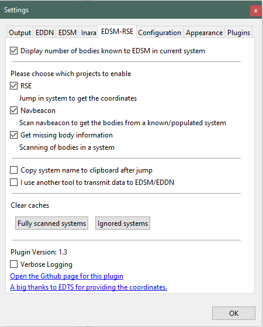

# EDSM-RSE plugin for [EDMC](https://github.com/Marginal/EDMarketConnector/wiki)

Elite: Dangerous Star Map - Red Star Eliminator (EDSM-RSE) is a plugin that displays names and distances to nearby systems of interest for projects of EDSM. Originally designed to seek out unknown coordinate stars, it has branched out to include several other projects.

Systems without coordinates originate from a time, when there was no journal file. Explorers would upload their flight path to EDSM by sending only the system name. Back then, manual trilateration was required to determine where the system is located in the galaxy. Because of this lengthy (and annoying) process, only a small percentage of the systems had coordinates associated to them. Since the introduction of the journal in EDSM, we no longer need to do this for new systems. But we have a backlog...

Other projects currently going on are:
Scan populated systems - with the addition of nav beacon scans to the journal, EDSM and EDDN as a whole are interested in getting this data cataloged. 

## Installation

1. On EDMC's Plugins settings tab press the _Open_ button. This reveals the _plugins_ folder where EDMC looks for plugins.
2. Download the [latest release](https://github.com/Thurion/EDSM-RSE-for-EDMC/releases).
3. Open the _.zip_ archive that you downloaded and move the _EDSM-RSE_ folder contained inside into the _plugins_ folder.

You will need to re-start EDMC to use the newly added plugin.

## Usage and Settings

Using this plugin only makes sense when the system locations are transmitted via EDDN or directly to EDSM. The plugin won't do anything if neither one is turned on. To overwrite that behavior, check the option that another tool is used to transmit the data in the settings menu.

There is a local cache on the plugin's folder called _cache.sqlite_. It stores systems in the form of their ID64, an expiration date for when to remove the system from the cache and a number to specify to which cache it belongs to. Because only a few numbers are stored in the database, it will grow very slowly in size.\
When you jump into a system that is part of a project, the system will be added to the local cache for one day to allow the remote database to catch up.

### Display number of bodies known to EDSM in current system

This option is turned on by default and will display how many bodies EDSM knows about in the current system.\
After you jump into a system, use the discovery scanner to trigger the display in EDMC's main window. The number won't count up as you scan bodies in the system. However, once all bodies are scanned, it will show that the system is complete and will add the system to a local cache. This is done to prevent repeated EDSM calls when jumping around in the same systems.\
The cache can be cleared by pressing the "Fully scanned systems" button in the settings.

* When the body count shows something like ``0/42``, it means that EDSM knows none of the possible 42 bodies.
* A body count like ``3/42`` means that EDSM knows only about 3 of the bodies. To check which ones, you can look up the system on the EDSM website.
* A body count like ``42/42`` means that EDSM knows about all bodies in this system.
* There is a rare case where the first number is larger than the second, e.g. ``45/42``. If this happens, please report the system on [EDSM's discord](https://discord.gg/0sFOD6GxFZRc1ad0). One of the EDSM admins can remove the erroneous bodies.

### Ignore a system

In case you want to ignore a system for whatever reason, you can do so by right clicking the unconfirmed system name like so:\

* ``Ignore this session`` will ignore a system for as long as EDMC keeps running.
* ``Ignore for 24 hours`` will ignore a system for one day. It doesn't matter if you restart EDMC.
* ``Ignore indefinetely`` will ignore a system forever. (Or actually until 2038, when the program will run into a problem with timestamps. See [Year 2038 problem](https://en.wikipedia.org/wiki/Year_2038_problem))

All ignored systems can be cleared in the settings.

### Projects

There are currently two active projects: RSE and scan navbeacons.\
To disable one or more projects, go into the settings and remove the checkmark next to the project name. A globally disabled project won't show up regardless of the local setting.

## Acknowledgments

* RapidfireCRH came up with the idea originally. He can be found on the [EDCD discord](https://discord.gg/0uwCh6R62aQ0eeAX) helping people who run into problems. Just ask in the EDMC channel.
* The estimated coordinates for the systems were created by [EDTS](https://bitbucket.org/Esvandiary/edts)
* Big thanks to Amiganer_Christian for hosting the remote server and helping with scan tracking.
* This plugin is part of the EDMC repack by Six-Shooter. You can download the repack at http://edfs.space/index.php/Tools
