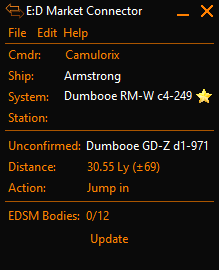

# EDSM-RSE plugin for [EDMC](https://github.com/Marginal/EDMarketConnector/wiki)

Elite: Dangerous Star Map - Red Star Eliminator (EDSM-RSE) is a plugin that displays the name and distance to a nearby system, that is of interest for projects of EDSM. Originally designed to seek out unknown coordinate stars, it has branched out to include several other projects.

Systems without coordinates originate from a time, when there was no journal file. Explorers would upload their flight path to EDSM by sending only the system name. Back then, manual trilateration was required to determine where the system is located in the galaxy. Because this was a lengthy and annoying process only a small percentage of the systems back then had coordinates associated to them.

Other projects currently going on are:
Scan populated systems - with the addition of nav beacon scans to the journal, EDSM and EDDN as a whole are interested in getting this data cataloged. 

## Installation

1. On EDMC's Plugins settings tab press the _Open_ button. This reveals the _plugins_ folder where EDMC looks for plugins.
2. Download the [latest release](https://github.com/Thurion/EDSM-RSE-for-EDMC/releases).
3. Open the _.zip_ archive that you downloaded and move the _EDSM-RSE_ folder contained inside into the _plugins_ folder.

You will need to re-start EDMC to use the newly added plugin.

## Usage

A few settings can be configured:
* How often the plugin will check for systems without coordinates
    * 1 means it will check for systems after every jump and 7 will do so only every 7 jumps. A few things happen on an update: 
	    1. Get systems that match the radius from the remote database
		2. Calclate the distance to all of them
		3. Ask EDSM for the closest 15 systems if they are still missing coordinates. This happens up to 3 times for a total of up to 45 systems. A particular system is checked once every hour at most.
		4. If there are any nearby systems left in the list, show the closest systems with an estimated distance to it and copy the name to the clipboard if it is turned on.
* Whether to copy the system name to clipboard or not

Using this plugin only makes sense when the system locations are transmitted via EDDN or directly to EDSM. The plugin won't do anything if neither one is turned on. To overwrite that behavior, check that another tool is used to transmit the data.

## Acknowledgments

* RapidfireCRH came up with the idea originally and was highly involved in the project.
* The estimated coordinates for the systems were created by [EDTS](https://bitbucket.org/Esvandiary/edts)
* Big thanks to Amiganer_Christian for hosting the remote server and helping with scan tracking.
* This plugin is part of the EDMC repack by Six-Shooter. You can download the repack at http://edfs.space/index.php/Tools
